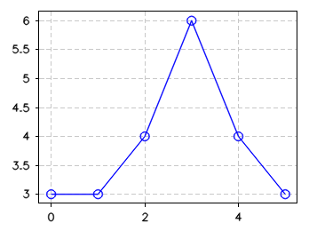
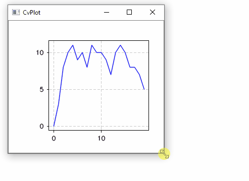
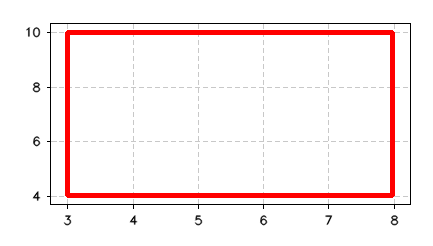
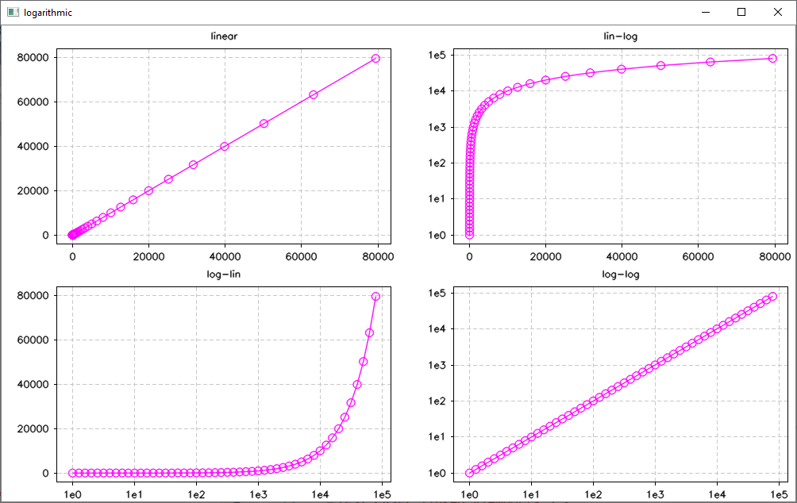
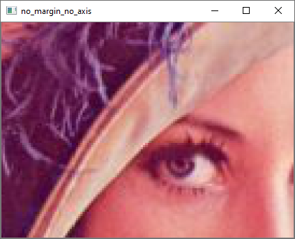
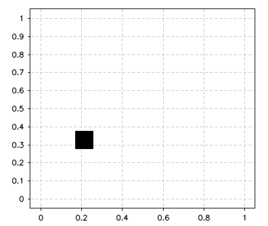
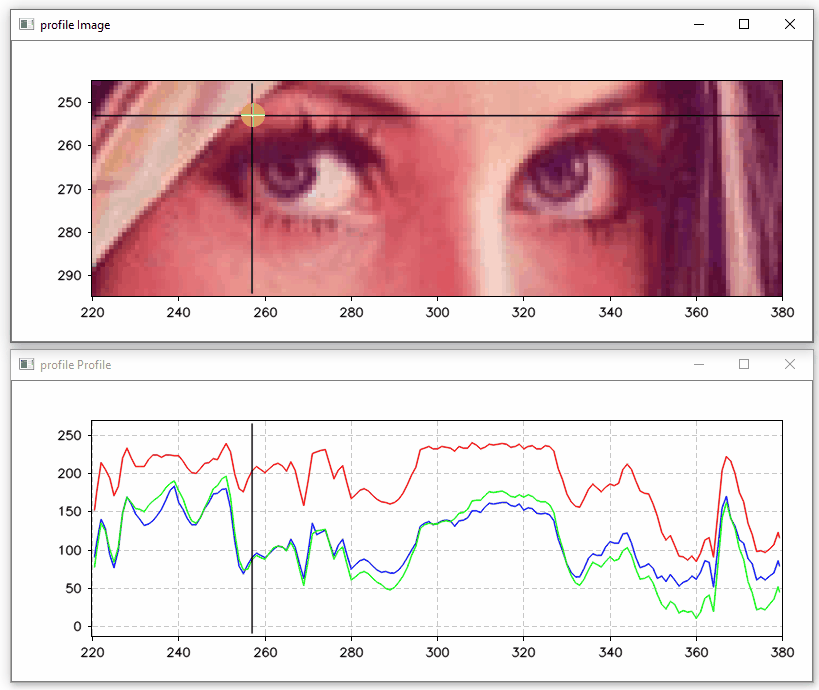
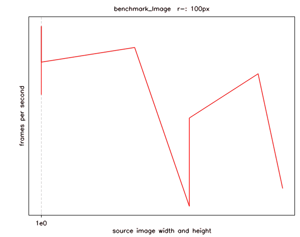
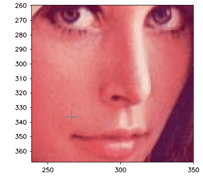
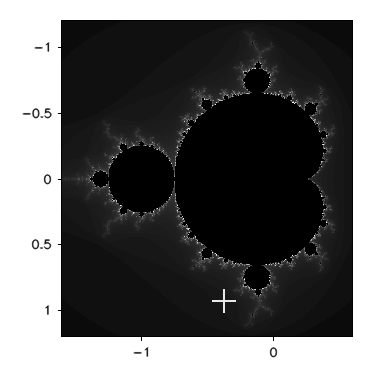

# Integration
CvPlot requires OpenCV. It was tested with OpenCV 3.4 and 4.1, but it should run with any recent version on any platform. There are multiple ways to integrate CvPlot in your project:

## Header-only
This is the easiest way and should almost always work. Just be sure you have OpenCV available in the include path.
- Clone or download from https://github.com/Profactor/cv-plot/releases
- Add CvPlot/inc to your project's include path

## Conan Package Manager
[Conan](https://conan.io/) packages are available here: https://bintray.com/profactor/conan/CvPlot%3Aprofactor-public
- Run this from command line: conan remote add profactor https://api.bintray.com/conan/profactor/conan 
- Add this requirement to your conanfile: CvPlot/1.2@profactor-public/stable
- Options:
   - CvPlot:header_only [default False]
   - CvPlot:shared [default False] 
- Conan will automatically install OpenCV from the conan center. You may [override](https://docs.conan.io/en/latest/using_packages/conanfile_txt.html#overriding-requirements) the OpenCV version in your conanfile.
- If you cannot find a matching binary package, use header_only=True.

## CMake (advanced)
- The CMakeLists.txt file in the root folder expects that you run ´conan install´ before. 
- You may also build without Conan or add CvPlot to some project with add_subdirectory. In this case, use the CvPlot subdirectory, not the root CMakeLists.txt!
- Variables
   - CVPLOT_HEADER_ONLY [default ON]
   - CVPLOT_WITH_TESTS [default ON]
   - CVPLOT_WITH_EXAMPLES [default ON]
   - [BUILD_SHARED_LIBS](https://cmake.org/cmake/help/latest/variable/BUILD_SHARED_LIBS.html)

# Plotting

## Your first Plot

The easiest way to get a diagram, is to use the plot() function. It takes a [cv::InputArray](https://docs.opencv.org/3.4/d4/d32/classcv_1_1__InputArray.html), so you can plot cv::Mat, std::vector, etc. plot() returns a CvPlot::Axes object. Use CvPlot::Axes::render() to render the diagram to a cv::Mat.

```c++
#include <CvPlot/cvplot.h>
auto axes = CvPlot::plot(std::vector<double>{ 3, 3, 4, 6, 4, 3 }, "-o");
cv::Mat mat = axes.render(300, 400);
```



You can show the result with

```c++
cv::imshow("mywindow", mat);
cv::waitKey();
```

CvPlot comes with an interactive OpenCV based viewer. We can modify the above example to use it instead of cv::imshow():

```c++
#include <CvPlot/cvplot.h>
auto axes = CvPlot::plot(std::vector<double>{ 0, 3, 8, 10, 11, 9, 10, 8, 11, 10, 10, 9, 7, 10, 11, 10, 8, 8, 7, 5});
CvPlot::show("mywindow", axes);
```

or even shorter

```c++
#include <CvPlot/cvplot.h>
CvPlot::showPlot(std::vector<double>{ 0, 3, 8, 10, 11, 9, 10, 8, 11, 10, 10, 9, 7, 10, 11, 10, 8, 8, 7, 5});
```



Navigation:
- Zoom: Mouse wheel or drag with pressed right mouse button (x/y unconstrained)  
- Pan: Drag with pressed mouse wheel / middle mouse button
- Reset: Double click right mouse button

## Multiple Series in one Plot

You can add multiple plot series to an Axes object using Axes::create():

```c++
#include <CvPlot/cvplot.h>
std::vector<double> x(20*1000), y1(x.size()), y2(x.size()), y3(x.size());
for (size_t i = 0; i < x.size(); i++) {
	x[i] = i * CV_2PI / x.size();
	y1[i] = std::sin(x[i]);
	y2[i] = y1[i] * std::sin(x[i]*50);
	y3[i] = y2[i] * std::sin(x[i]*500);
}
auto axes = CvPlot::makePlotAxes();
axes.create<CvPlot::Series>(x, y3, "-g");
axes.create<CvPlot::Series>(x, y2, "-b");
axes.create<CvPlot::Series>(x, y1, "-r");
CvPlot::show("mywindow", axes);
```


## Images

Use plotImage() instead of plot() to create an image plot:

```c++
#include <CvPlot/cvplot.h>
auto mat = cv::imread("exampledata/Lenna.jpg"); 
auto axes = CvPlot::plotImage(mat);
cv::Mat mat = axes.render(300, 400);
```

Again, you may use the interactive viewer with

```c++
auto axes = CvPlot::plotImage(mat);
CvPlot::show("mywindow", axes);
```

or as a one-liner:

```c++
CvPlot::showImage(mat);
```


## Image and Overlay

In this example, multiple Series are added on top of an Image:

```c++
cv::Mat1b image(40, 120, 255);
cv::putText(image, "CvPlot", { 5,30 }, cv::FONT_HERSHEY_TRIPLEX, 1, cv::Scalar::all(200), 5, cv::LINE_AA);
std::vector<std::vector<cv::Point>> contours;
cv::findContours(image == 200, contours, cv::RETR_LIST, cv::CHAIN_APPROX_TC89_L1);

auto axes = CvPlot::plotImage(image);
axes.enableHorizontalGrid();
axes.enableVerticalGrid();
for (auto contour : contours) {
    contour.push_back(contour.front()); //close polygon
    axes.create<CvPlot::Series>(contour, "k-o");
}
CvPlot::show("contours", axes);
```


## Custom Drawables

Everything that is drawn in CvPlot is derived from CvPlot::Drawable, even axes, titles, and grid. You can replace any of these standard drawables with your own implementation and extend CvPlot with your own drawables. 

The following example draws a rectangle using a custom drawable. MyRect overrides two methods of CvPlot::Drawable:
- render()
    - Uses renderTarget.project() to calculate the position of the rectangle corners in pixel space
    - Uses cv::rectangle() to draw directly to the render buffer
- getBoundingRect()
    - This is used to tell CvPlot how to determine automatic axes limits.

```c++
struct MyRect :public CvPlot::Drawable {
	cv::Rect2d _rect = cv::Rect2d(3, 4, 5, 6);
	void render(CvPlot::RenderTarget &renderTarget) override {
		auto p1 = renderTarget.project({ _rect.x, _rect.y });
		auto p2 = renderTarget.project({ _rect.x + _rect.width, _rect.y + _rect.height });
		cv::rectangle(renderTarget.innerMat(), cv::Rect2d(p1, p2), cv::Scalar(0, 0, 255), 3);
	}
	bool getBoundingRect(cv::Rect2d &rect) override {
		rect = _rect;
		return true;
	}
};
auto axes = CvPlot::makePlotAxes();
axes.create<MyRect>();
CvPlot::show("custom drawable", axes);
```


	
## More Examples

You can find more examples in https://github.com/Profactor/cv-plot/tree/master/CvPlot/examples.

### Logarithmic


### Double Matrix


### No Margin


### Drag


### Profile


### Benchmark


### Paint


### Mandelbrot


